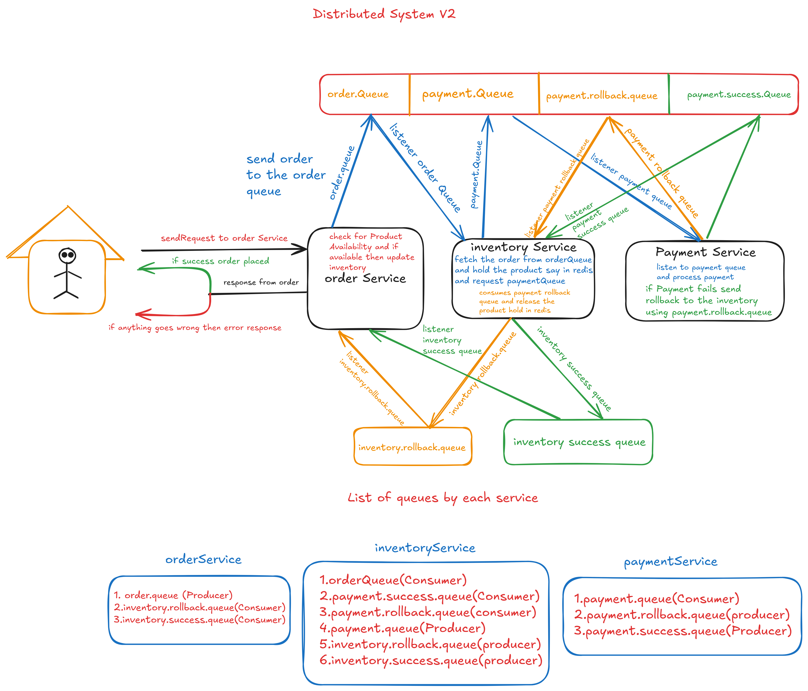

# Distributed Order Management System

A microservices-based distributed system simulating an end-to-end **order management workflow** using Spring Boot 3.4.4, RabbitMQ, Redis, Zipkin for tracing, and Swagger for API documentation.

## Architecture Overview

This project follows the **Saga Choreography Pattern** for asynchronous communication using RabbitMQ. It includes:

- **Order Service** – Initiates the order and handles rollback/success flows.
- **Inventory Service** – Reserves and releases inventory using Redis as a temporary store.
- **Payment Service** – Simulates payment processing and confirms or rolls back based on transaction status.
- **Product Service** – Manages product details and availability.

Each service communicates using dedicated RabbitMQ queues and exchanges.

 <!-- Replace `architecture.png` with your image file name -->

---

## Features

- **RabbitMQ** for asynchronous, decoupled message passing
- **Manual Acknowledgement** and DLQ setup for message reliability
- **Saga Pattern (Choreography)** for distributed transaction management
- **Zipkin + Micrometer Tracing** for full observability
- **Redis** to temporarily lock inventory items
- **Swagger** for easy testing and API exploration

---

## Tech Stack

- **Java 17**, **Spring Boot 3.4.4**
- **RabbitMQ**
- **Redis**
- **Zipkin** for distributed tracing
- **Micrometer Tracing**
- **OpenAPI/Swagger**

---

## Run the System

### Prerequisites

- Java 17+
- RabbitMQ (default port: `5672`)
- Redis 
- Zipkin (default port: `9411`)
- Maven or Gradle
